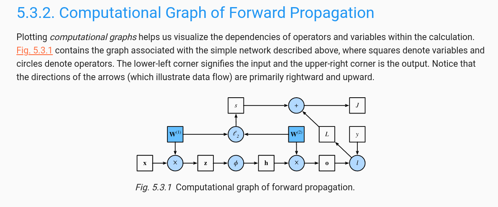

- ## we can approximate many functions much more compactly by using **deeper** (rather than wider) networks ([Simonyan and Zisserman, 2014](https://d2l.ai/chapter_references/zreferences.html#id260 "Simonyan, K., & Zisserman, A. (2014). Very deep convolutional networks for large-scale image recognition. ArXiv:1409.1556."))
- 
- ## Activation Functions:
	- ### ReLU Function : **$RELU(x)$ $=$ $max(x,0)$**
	- ### parametrized ReLU (_pReLU_): **$PRELU(x)$ $=$ $max(x,0)$$+$$\alpha$$min(x,0)$ 
	- ### Sigmoid Function : $\operatorname{sigmoid}(x) = \frac{1}{1 + \exp(-x)}$
		- Sigmoids are still widely used as activation functions on the output units when we want to interpret the outputs as probabilities for binary classification problems: you can think of the sigmoid as a special case of the softmax. However, the sigmoid has largely been replaced by the simpler and more easily trainable ReLU for most use in hidden layers. Much of this has to do with the fact that the sigmoid poses challenges for optimization ([LeCun _et al._, 1998](https://d2l.ai/chapter_references/zreferences.html#id162 "LeCun, Y., Bottou, L., Orr, G., & Muller, K.-R. (1998). Efficient backprop. Neural Networks: Tricks of the Trade. Springer.")) since its gradient vanishes for large positive _and_ negative arguments. This can lead to plateaus that are difficult to escape from.
		- # **$\frac{d}{dx}\operatorname{sigmoid}(x) = \frac{\exp(-x)}{(1 + \exp(-x))^2} = \operatorname{sigmoid}(x)(1 - \operatorname{sigmoid}(x))$**
	- ### Tanh Function: $\tanh(x) = \frac{1 - \exp(-2x)}{1 + \exp(-2x)}$ 

**A secondary benefit is that ReLU is significantly more amenable to optimization than the sigmoid or the tanh function. One could argue that this was one of the key innovations that helped the resurgence of deep learning over the past decade. Note, though, that research in activation functions has not stopped. For instance, the GELU (Gaussian error linear unit) activation function $x\Phi(x)$ by Hendrycks and Gimpel (2016) ($\Phi(x)$ is the standard Gaussian cumulative distribution function) and the Swish activation function $\sigma(x) = x\operatorname{sigmoid}(\beta x)$ as proposed in Ramachandran *et al.* (2017) can yield better accuracy in many cases.**

# Forward propagation

## FORWARD — calcule la loss
y_hat = model(X)
loss = loss_fn(y_hat, y) 
## BACKWARD — calcule les gradients
loss.backward() 
## UPDATE — descend le gradient 
optimizer.step()